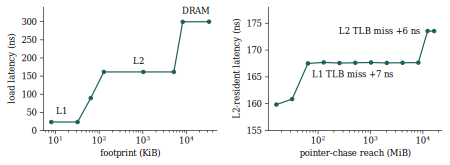
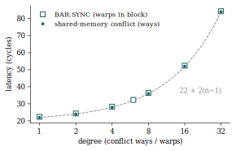
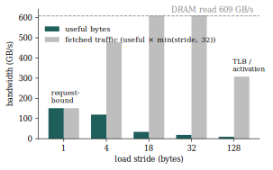
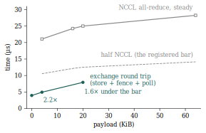

# Introduction

A used Quadro RTX 6000 sells for roughly a tenth of its launch price,
and two of them bridged by NVLink put 48 GB of GPU memory and a measured
1.2 TB/s of aggregate DRAM bandwidth on a desk. Whether that hardware
can carry a modern inference workload is not answerable from marketing
geometry: it depends on instruction latencies, cache behaviour, and
interconnect costs that NVIDIA does not publish and that existing
microbenchmark studies cover only for neighbouring chips. Jia et
al. dissected the TU104-based Tesla T4 (Jia et al. 2019); the larger
TU102, with its different L2, DRAM system, and NVLink, has no equivalent
public characterisation.

This paper measures one. In the style of Agner Fog’s x86 instruction
tables (Fog 2025a), it builds a complete operation table for the TU102
at compute capability 7.5 (instruction latency and throughput with
measured issue-pipe bindings, the full memory hierarchy from the
register file to DRAM, and the NVLink, PCIe, and NCCL interconnect
costs) from microbenchmarks whose every timed loop is verified at the
SASS level and whose every published row carries its provenance.

The research question is operational rather than encyclopaedic: *can a
table of independently measured primitive costs predict the behaviour of
real composite kernels well enough to drive engineering decisions?* The
answer, developed through three pre-registered hypotheses
(<a href="#sec:hypotheses" data-reference-type="ref+label"
data-reference="sec:hypotheses">4</a>), is sharply split. Composed
predictions are excellent where a single resource binds, within 3.5% on
single-resource kernels and within 10% on a latency-dominated
interconnect primitive, and fail systematically where work couples
across issue pipes or where a primitive row turns out to be a floor
rather than a typical cost. Both failure modes are measured, diagnosed,
and published.

The contributions are: (i) the table itself, 264 rows with per-row
provenance, priors, and deviation flags, regenerable from a fresh clone;
(ii) the measurement methodology, including a SASS-gated benchmark
discipline that caught every compiler-induced measurement defect before
a number shipped, and a clock-domain contract for a GPU whose memory
clock cannot be locked; (iii) findings absent from public documentation,
among them the fma-pipe binding of `IDP.4A`, the full-rate
f32-accumulate of Quadro-positioned TU102 tensor cores, the L1-retention
semantics of `.cs` loads, and the request-path saturation of the L2; and
(iv) a worked demonstration that pre-registration — gates, metrics, and
decision rules committed to a public repository before data collection —
transfers from empirical software engineering to microbenchmarking,
where the temptation to tune until numbers match priors is the central
threat to validity.

# Related work

Agner Fog’s instruction tables (Fog 2025a) are the model for the
artefact: exhaustive per-instruction latency and throughput for x86
microarchitectures, maintained as data rather than narrative, with the
measurement method documented separately (Fog 2025b). This work
transplants the form to a GPU and adds two things the x86 tables do not
carry: per-row provenance binding each number to the benchmark commit
and results line that produced it, and an explicit deviation column
against published priors.

GPU microbenchmarking begins for our purposes with Wong et al. (Wong et
al. 2010), who established pointer-chase latency measurement on GT200,
and Mei and Chu (Mei and Chu 2017), whose fine-grained pointer chase
resolved cache geometry on Kepler and Maxwell. Jia et al. characterised
Volta (Jia et al. 2018) and then Turing via the Tesla T4 (Jia et al.
2019); their instruction-latency tables are the priors this paper
compares against, row by row, where the prior applies. The applicability
boundary matters: the T4’s TU104 shares the TU102’s streaming
multiprocessor, so core-domain priors transfer, but its L2, DRAM system,
and lack of NVLink make memory-system and interconnect priors
non-binding — a distinction this paper records per row rather than per
paper.

Two methodological differences from Jia et al. are deliberate. First,
their measurements were taken with a custom SASS assembler, giving
direct control of the instruction stream; this work stays within the
public toolchain (PTX inline assembly under `nvcc` 13.3) and instead
*verifies* the emitted stream, gating every benchmark on a disassembly
check. The compiler fights this approach — constant folding,
uniform-datapath conversion, strength reduction, and
approximate-arithmetic algebra each deleted or rewrote measurement
kernels during development — and
<a href="#sec:methodology" data-reference-type="ref+label"
data-reference="sec:methodology">3</a> catalogues the countermeasures,
because any future toolchain-bound measurement effort will face the same
opponents. Second, where their report states results, this one also
pre-registers the decision-grade questions
(<a href="#sec:hypotheses" data-reference-type="ref+label"
data-reference="sec:hypotheses">4</a>) and publishes the failures.

# Methodology

All numbers come from one rig: a Dell T5820 (Xeon W-2140B) holding two
Quadro RTX 6000 GPUs, both at PCIe 3.0 x16, bridged by a two-link NV2
NVLink, driver 610.43.02, CUDA toolkit 13.3.33, ECC disabled on both
devices, CPU governor pinned to `performance`. The table is a snapshot
of this toolchain and driver pairing, not a living document; the
append-only results layout admits later datasets without disturbing this
one.

## Clock contract

Cycle-domain rows require a fixed SM clock; the harness prechecks a
1455 MHz lock (`nvidia-smi -lgc`) at startup and exits otherwise. The
memory clock cannot be locked on this part: `-lmc` reports unsupported
and the applications-clock interface is deprecated in this driver. What
holds instead, measured on both GPUs, is that CUDA compute always
executes in the P2 performance state with the memory clock at 6500 MHz.
The harness ramps into P2 with a warmup kernel, verifies the memory
clock under load, and samples both clocks around every repetition,
rejecting any where either is off target. Bandwidth expectations are
therefore stated against the P2 memory clock — a 624 GB/s DRAM ceiling
rather than the 672 implied by the unreachable P0 point.

## Timing

Latency rows use `clock64()` around dependent chains, with loop overhead
cancelled by a doubled-trip-count slope and the loop body verified by
size to fit the L0 instruction cache. Pointer-chase rows embed full
64-bit pointers (or byte offsets, in shared and constant windows) so the
timed step is a single dependent load with no address arithmetic (Wong
et al. 2010; Mei and Chu 2017). Throughput rows are also timed in actual
SM cycles, by one block on one SM: wall-clock event timing normalised by
the nominal locked clock showed a 0.3–1.0% between-run spread that grew
with region length — real-clock thermal sag under the lock — where
on-device cycle counts are immune. Host-domain rows (launches, events,
NCCL calls) use `steady_clock` over a thousand repetitions with a
device-event cross-check, reported as median with the 10th and 90th
percentiles.

## SASS verification

Operation selection is pinned by PTX inline assembly, and
`check_sass.py` disassembles every benchmark binary, locates each timed
loop, and enforces that it contains the intended instructions and
nothing unexplained. The gate is not a formality. Working through the
table, `ptxas` or the NVVM front end variously: constant-folded integer
chains built on literal operands; moved warp-uniform integer chains onto
the uniform datapath (`UPOPC` on `UR` registers); strength-reduced
dependent add chains into `IMAD` and `LEA` through both a dead carry-out
pin and cross-coupled accumulators; deleted six of eight independent
accumulator chains whose results a sink did not consume; folded
`rcp.approx` compositions as exact algebra, twice; contracted a
deliberately separate add into an `FFMA`; lowered an f16 widening
conversion to `HADD2` rather than the expected `F2F`; and expanded a
64-bit remainder into a division subroutine call whose float-reciprocal
emulation put `MUFU` and conversion traffic inside a bandwidth loop.
Every one of these was caught by counting emitted mnemonics against the
design, not by a timing looking wrong — several produced plausible
numbers for the wrong instruction stream. Both gates carry negative
tests: a deliberately unlocked clock and a deliberately miscompiled
kernel must fail.

## Statistics and gate taxonomy

Each row is the median of ten repetitions, with the coefficient of
variation published; every published row further requires at least two
independent process invocations on each GPU, and the between-run spread
must not exceed the within-run variation beyond a domain floor (0.1% for
cycle rows, 0.5% for wall-clock bandwidths, 5% for host-domain times).
SM-domain rows must agree across the two physical GPUs within their
combined variation; interconnect rows differ by design and carry
direction in the variant. Verification gates are of two kinds, and
confusing them is how benchmark suites quietly tune themselves to the
literature: *methodology-sanity* gates (two independent methods must
agree) block publication on failure, while *prior-comparison* gates
(against (Jia et al. 2019) or whitepaper geometry) publish the deviation
whatever it is. The table exists to report true deviations.

## Pre-registration

The coverage manifest and measurement policy were committed to the
public repository before any benchmark ran, and the three decision-grade
hypotheses of <a href="#sec:hypotheses" data-reference-type="ref+label"
data-reference="sec:hypotheses">4</a> were committed — predictions,
operationalisations, and decision rules — before their data existed
(repository commit `a4fdd73`, 2026-06-10, preceding every measurement it
governs). The commit history is the receipt. One registered rule fired
mid-study and was honoured: a composed-prediction gate failed at its
registered tolerance, and the affected comparison was blocked rather
than re-derived, until independently measured constituents allowed a
documented remediation
(<a href="#sec:hypotheses-outcomes" data-reference-type="ref+label"
data-reference="sec:hypotheses-outcomes">4.4</a>).

## A worked row

The discipline end to end, for `alu.ffma.lat`: a 128-deep dependent
`fma.rn.f32` chain on runtime operands compiles to exactly 128 `FFMA` in
the timed loop (gate: pass); ten repetitions at two trip counts give a
slope of 4.07 cycles with zero within-run variation; four invocations
across both GPUs agree within the 0.1% floor; the prior is 4 cycles (Jia
et al. 2019, tab. 4.1); the row publishes as 4.07, deviation $`+1.8\%`$,
flag `ok`, with provenance naming the benchmark file, commit, and
results lines.

# Registered hypotheses

Three questions in this work are decision-grade: their answers change
what the consuming inference project builds next. Each is registered
here — hypothesis, operationalisation, predictions, decision rule —
before the corresponding data is gathered, with this repository’s commit
history as the receipt. The remaining verification gates in the paper
are ordinary methodology checks and are deliberately not elevated to
this status.

## Issue-coupled costs and differential projection

This hypothesis was formed after the pipe-binding measurements (which
placed `IDP.4A` on the fma pipe, contending with FFMA issue slots) and
is registered before any differential-projection data exists.

*Projected cost deltas between kernel variants that shift work onto a
contended issue pipe carry larger projection error than deltas that
shift the same work onto an uncontended pipe; under a purely additive
cost model the excess swallows the flash-attention variant-arbitration
margin.*

Operationalisation: one synthetic base kernel; graded injections of FFMA
and `IDP.4A` (fma pipe, contended), `LOP3` (alu pipe, uncontended at the
operating point), and `POPC` (separate quarter-rate unit); injection
sizes chosen so true deltas land in the 5–25% band, the arbitration
operating range. Two cost models are compared: *naive additive* (op
count $`\times`$ reciprocal throughput, summed) and *per-pipe max*
(per-pipe issue demand, maximum across pipes, capped at the
4-per-SM-cycle issue rate).

Registered predictions: (i) additive-model differential error is larger
for fma-pipe injections than for alu-pipe injections; (ii) the
per-pipe-max model removes most of that excess; (iii) given (ii), the
per-pipe-max differential error bound discriminates deltas of 10% and
above.

Decision rule: the flash-attention variant arbitration proceeds by
projection only if the measured per-pipe-max differential error bound is
below the projected inter-variant delta; otherwise the projection route
is abandoned for that decision and both variants are implemented and
measured.

## A hand-rolled NVLink exchange against the NCCL call floor

Registered before any interconnect measurement exists.

*A peer-store-plus-fence exchange primitive over NVLink completes a
two-GPU exchange of at most 20 KiB in less than half the steady-state
NCCL all-reduce per-call time at the same size.*

Operationalisation: the primitive is a peer `STG`,
`__threadfence_system()`, and a system-scope flag poll, measured
end-to-end and litmus-tested for correctness (message passing with a
data check). The comparator is a two-rank NCCL all-reduce over 4–64 KiB
with `NCCL_ALGO`, `NCCL_PROTO`, and channel count pinned and recorded,
taken at steady state (cold-channel rows are separate). Before the
comparison is made, a composed prediction of the primitive’s round trip
from its constituent table rows (peer-store latency, fence cost, poll
read) must agree with the end-to-end measurement within a stated
tolerance — the interconnect analogue of the projection gate.

Decision rule: the deterministic peer-exchange mechanism in the
consuming project proceeds only if the validated primitive beats half
the freshly re-measured NCCL per-call floor at 20 KiB and below;
otherwise the mechanism is recorded as not viable on this fabric.

## Dispatch-cost composition and the decode ceiling

Registered before any launch-family measurement exists.

*The launch-family rows (empty-kernel dispatch, graph-node replay, event
costs) compose to predict the per-token host dispatch overhead of a
production-shaped decode graph within $`\pm20\%`$, and the graph-replay
rows predict the decode-rate ceiling that full capture would unlock.*

Operationalisation: per-token dispatch overhead is node count $`\times`$
the relevant per-node row, compared against a profiler baseline measured
freshly on the same host and driver — prior-session anchors are
re-measured, never reused. The ceiling prediction divides measured
compute time by the sum of compute time and predicted captured dispatch
time.

Decision rule: the consuming project’s capture work is prioritised by
the predicted ceiling; a composed prediction outside $`\pm20\%`$ blocks
the use of these rows for that prioritisation and is published as a
model failure.

## Outcomes

Recorded after the data, against the rules as registered.

*Issue coupling*
(<a href="#sec:hyp-coupling" data-reference-type="ref+label"
data-reference="sec:hyp-coupling">4.1</a>): prediction (i) was confirmed
— additive-model differential error is larger for fma-pipe injections
than alu-pipe ones — but prediction (ii) was refuted on its registered
metric, because the additive model is so uniformly poor (93–480%
differential error) that its between-pipe gap is small; the per-pipe-max
model shows the coupling structure instead, with 3–5% differential error
on uncontended injections against 21–28% on fma-coupled ones. Prediction
(iii) failed: the bound does not discriminate 10% deltas. The decision
rule then fired on the real pair: the projection put the dp4a attention
variant at $`-3.9\%`$ where measurement says $`+18.9\%`$ — the wrong
sign, because both variants project issue-bound while reality charges
the fma-pipe coupling — and that variant’s arbitration fell back to
implement-and-measure as registered. The staged variant’s projection, by
contrast, landed within 5% of measurement (a single resource, shared
memory, binds it), and projection arbitrates that branch.

*The NVLink exchange*
(<a href="#sec:hyp-exchange" data-reference-type="ref+label"
data-reference="sec:hyp-exchange">4.2</a>): **confirmed across the
registered domain**, in three documented steps. The composed gate passed
flag-only ($`-14\%`$) and failed with payload, because the registered
composition charged the payload at streaming bandwidth a single warp
cannot reach — the same floor-row failure mode as the dispatch
hypothesis below, observed independently. With the constituents
re-measured at the right width (a single-warp store burst and a
single-warp consumption row), the remediated gate passed at 4 KiB
($`-10\%`$) but still under-predicted 20 KiB by 28%; the residual was
named — a first-read-after-peer-write visibility cost with no table row
— and the comparison stayed blocked there until the row existed.
Measured by its own instrument (the responder times only its read
section), the visibility row puts the first read of 20 KiB of freshly
peer-written lines at 2.59 s against 1.14 steady-state, and the
visibility-aware composition closes the gate at both sizes ($`-4.5\%`$
at 4 KiB, $`-10.3\%`$ at 20). The registered comparison therefore
applies across its stated domain: 4.92 s against a bar of 10.78 at 4 KiB
(margin 2.2$`\times`$), 7.94 against 12.51 at 20 KiB (margin
1.6$`\times`$).

*Dispatch composition*
(<a href="#sec:hyp-dispatch" data-reference-type="ref+label"
data-reference="sec:hyp-dispatch">4.3</a>): refuted. A production-shaped
decode dispatches 4,614 kernels per token; composed against the
empty-launch row this predicts 7.2 ms of per-token dispatch against
14.9 ms measured ($`-52\%`$). The empty-launch row is a floor: in-situ
launches average 3.13 s against the row’s 1.56, and four candidate
mechanisms for the gap — argument marshalling, kernel-identity variety,
cross-device alternation, and submission-queue backpressure — were each
measured and exonerated, leaving driver-state interaction as the
documented residual. Per the registered rule the rows are barred from
driving the capture prioritisation, which instead takes the direct
measurement: a 29.9% launch share at this shape, and a graph-replay row
(0.91 s per node, 42% below eager) bracketing the capture uplift at
$`+15`$ to $`+27\%`$.

One sentence of synthesis the three outcomes share: *primitive rows are
floors, and composition is trustworthy exactly where one resource
binds*. The registration discipline did not make the models better; it
made their failures unignorable, cheap to localise, and safe to publish.

# SM pipelines

## The core table

The four-cycle class (Jia et al. 2019, tab. 4.1) reproduces: `FFMA`,
`FADD`, `FMUL`, `LOP3`, `SHF`, `SEL`, and the derived `IADD3`, `ISETP`,
and `FSETP` all measure between 3.96 and 4.13 cycles. `POPC` and `FLO`
measure exactly 15, `HFMA2` 6.19, both on prior. Three deviations
publish: `IMAD` at 4.11 cycles against a prior of 5 ($`-17.8\%`$),
`DADD` at 44.0 against $`{\sim}48`$, and `DFMA` at 48.0 against
$`{\sim}54`$. Rows with no published prior are contributions: `PRMT` at
4.13 cycles, `IDP.4A` at 4.11 cycles and the full 2.0 warp-instructions
per SM per cycle, and the emulated `u32` divide at 55.5 cycles per
sequence. Throughput saturates at 2.0 warp-instructions per SM per cycle
for both the FP32 and INT32 classes — 64 lanes of each per SM — with the
FFMA anchor landing within 0.005% of the geometric 2.0.
<a href="#tab:core" data-reference-type="ref+Label"
data-reference="tab:core">1</a> collects these rows; the repository
table carries the remaining variants and the provenance columns.

|             |      | latency (cycles) |       |           |  throughput |
|:------------|:-----|-----------------:|------:|----------:|------------:|
| 3-5 op      | pipe |            meas. | prior |    dev. % | (wi/SM/clk) |
| `FFMA`      | fma  |              4.1 |     4 |  $`+1.8`$ |        2.00 |
| `FADD`      | fma  |              4.1 |     4 |  $`+2.9`$ |        2.00 |
| `FMUL`      | fma  |              4.1 |     4 |  $`+2.9`$ |        2.00 |
| `IMAD`      | fma  |              4.1 |     5 | $`-17.8`$ |        2.00 |
| `IADD3*`    | –    |              4.0 |     4 |  $`-1.0`$ |        1.98 |
| `LOP3`      | alu  |              4.1 |     4 |  $`+2.7`$ |        1.97 |
| `SHF`       | alu  |              4.1 |     4 |  $`+2.7`$ |        1.97 |
| `SEL`       | alu  |              4.1 |     4 |  $`+2.5`$ |        1.95 |
| `PRMT`      | alu  |              4.1 |     – |         – |        1.97 |
| `ISETP*`    | –    |              4.0 |     4 |  $`-0.8`$ |        1.98 |
| `IDP.4A.S8` | fma  |              4.1 |     – |         – |        2.00 |
| `HFMA2`     | own  |              6.2 |     6 |  $`+3.1`$ |        1.96 |
| `DADD`      | own  |             44.0 |    48 |  $`-8.3`$ |        0.05 |
| `DFMA`      | own  |             48.0 |    54 | $`-11.1`$ |        0.05 |
| `POPC`      | own  |             15.0 |    15 |  $`+0.0`$ |        0.50 |
| `FLO`       | own  |             15.0 |    15 |  $`+0.0`$ |        0.50 |
| `MUFU.EX2`  | –    |             15.0 |    15 |  $`+0.0`$ |        0.50 |
| `MUFU.RSQ`  | –    |             15.0 |     – |         – |        0.50 |
| `MUFU.SIN`  | –    |             21.0 |     – |         – |        0.50 |
| `SHFL.IDX`  | –    |             25.0 |     – |         – |        0.50 |

Core instruction rows. Latency by dependent `clock64` chain, throughput
at the peak of the warps-per-SM sweep, pipe bindings by contention probe
(<a href="#sec:methodology" data-reference-type="ref+label"
data-reference="sec:methodology">3</a>); *own* marks a dedicated unit.
Starred rows derive from pair constructions. Latency priors from Jia et
al. (Jia et al. 2019).

Some rows are measurable only as pairs from PTX: a predicate cannot be
chained, so `ISETP` latency derives from a compare-plus-select chain
minus the select chain; a pure dependent add chain cannot be pinned at
all (every guard was strength-reduced), so `IADD3` derives from an
add-xor pair minus the `LOP3` row. Each derived row names its
construction.

## Pipe bindings

Contention probes
(<a href="#sec:methodology" data-reference-type="ref+label"
data-reference="sec:methodology">3</a>) bind each operation to its issue
pipe by mixing it 50/50 with a known reference and comparing the
combined rate against same-pipe (harmonic) and distinct-pipe (maximum,
capped at the 4-per-SM-cycle issue rate) predictions. The probe
self-tests pass — FFMA against itself reads same-pipe, FFMA against LOP3
reads distinct — and the map follows: `IMAD` issues on the fma pipe,
confirming the Turing arrangement by measurement; `SHF`, `SEL`, and
`PRMT` on the alu pipe; `POPC` and `FLO` on a quarter-rate unit that
further *partially* contends with the load path (a mixed POPC-and-load
stream runs at 0.68 of the distinct-pipe prediction); and —
consequentially for quantised inference kernels — **`IDP.4A` issues on
the fma pipe**, competing with `FFMA` for issue slots rather than riding
the integer pipe.

## Tensor cores

The m16n8k8 `HMMA` with f16 accumulate measures 0.50000
warp-instructions per SM per cycle, exactly the whitepaper-derived 512
FMA per SM per cycle (NVIDIA Corporation 2018); `IMMA` m8n8k16 likewise
lands exactly on its derived 1.0. The f32-accumulate prior of half rate
is *refuted on this part*: measured 0.49996, identical to f16
accumulate. The half-rate figure describes GeForce-positioned TU102s;
the Quadro runs full-rate f32 accumulation — a market-segmentation fact
rather than a microarchitectural one, and worth a row precisely because
the whitepaper does not say it. A dependent accumulate chain puts `HMMA`
latency at 14.0 cycles, and a contention probe confirms that `HFMA2`
shares the tensor unit (mixed rate 0.76 against a shared-unit prediction
of 0.80): FP16 math runs through the tensor cores, measured rather than
inferred. The operand-staging load, `LDSM` (`ldmatrix`), chains at 30
cycles through an address perturbation and peaks at 0.125
warp-instructions per SM per cycle in its four-tile form — 512 bytes per
instruction, exactly the 64-byte-per-cycle unified-datapath ceiling of
<a href="#sec:memory" data-reference-type="ref+label"
data-reference="sec:memory">6</a>: feeding the tensor cores is
bandwidth-bound on the same path as every other shared-memory access.
<a href="#tab:tensor" data-reference-type="ref+Label"
data-reference="tab:tensor">2</a> summarises.

| op                            | tput (wi/SM/clk) | prior |   dev. % |
|:------------------------------|-----------------:|------:|---------:|
| `HMMA.1688`, f16 accumulate   |            0.500 |     – |        – |
| `HMMA.1688`, f32 accumulate   |            0.500 |     – |        – |
| `IMMA.8816`, s8               |            1.000 |   1.0 | $`-0.0`$ |
| `HMMA.1688` dependent latency |      14.0 cycles |       |          |

Tensor-core rows. The f32-accumulate rate equals the f16-accumulate rate
on this Quadro-positioned part; the half-rate figure in circulation
describes GeForce-positioned TU102s.

## SFU, shuffle, divergence

The remaining `MUFU` set sits at 15 cycles (`RSQ`, `LG2`) with `SIN` and
`COS` as 21-cycle pairs carrying an `FMUL` range scale, all at the
quarter rate; `RCP` derives at $`{\sim}17`$ cycles after the
approximate-algebra deletions of
<a href="#sec:sass" data-reference-type="ref+label"
data-reference="sec:sass">3.3</a>. `SHFL.IDX` chains at 25 cycles and
0.5 per cycle; a ballot (`VOTE.ANY`) chains at 16.2 cycles and sustains
0.96 per cycle across independent chains, with the predicate
lane-shifted to keep the chain off the uniform datapath. A barrier in a
192-thread block costs 32.3 cycles whether or not a second 192-thread
block is resident on the same SM — the barrier unit serves two
concurrent CTAs without serialising them. Branch divergence is exactly
linear: a $`k`$-way divergent switch costs $`k`$ times the uniform path
(16.7 cycles to 528 for 1-way to 32-way), and the predicated equivalent
costs precisely the uniform 16.7 — if-conversion is free at this shape,
with reconvergence visible as `BSSY`/`BSYNC` in the SASS.

# Memory hierarchy

## Levels

Dependent chases place the levels at: L1 data 23.4 ns (34 cycles; the
read-only `__ldg` path measures the same 34, one physical array); L2
161.5 ns (235 cycles), flat from 128 KiB to 5 MiB with the cliff binding
between 5 and 8 MiB against the 6 MB L2; DRAM 299.9 ns. Bandwidths: DRAM
streams at 609 GB/s read (97.5% of the P2 ceiling, and within 0.3% of an
independent estimate from the sector experiment below), 477 write, 507
copy. The L2’s own service rate is lower than the DRAM streaming rate: a
4 MiB footprint read entirely from L2 via `.cg` sustains 382 GB/s (the
request-serving path saturates before the line-fill path), while the
same footprint under the default policy reads at 1.11 TB/s because it
nearly fits the *aggregate* L1 capacity (72 SMs $`\times`$ 64 KiB).
Shared memory and L1 share one 64-byte per-cycle-per-SM datapath (both
measure the same ceiling by two load widths), and the 96 KiB carveout
moves the L1 chase cliff exactly as the split predicts. A
fill-granularity probe (a capacity-evicted ring chased at growing byte
strides) reads the promotion unit directly: strides of 32 and above all
pay the full 235-cycle miss while stride 16 pays exactly the mean of a
miss and a hit and stride 8 one miss in four — the L1 fills 32-byte
sectors and prefetches nothing within the line. One hazard row: `float4`
shared-memory access compiles to paired `LDS.64` whose 16-byte stride
self-conflicts two-way, halving bandwidth — tiles built on `float4` pay
it. <a href="#fig:hierarchy" data-reference-type="ref+Label"
data-reference="fig:hierarchy">1</a> traces both chases and
<a href="#tab:memory" data-reference-type="ref+label"
data-reference="tab:memory">3</a> summarises the levels; conflict
serialisation is exactly linear at two cycles per additional way, and
`BAR.SYNC` obeys the same $`22 + 2(n{-}1)`$ law in warps per block
(<a href="#fig:laws" data-reference-type="ref+label"
data-reference="fig:laws">2</a>).

| level                                |  latency |            bandwidth |
|:-------------------------------------|---------:|---------------------:|
| shared memory (no conflict)          |   22 cyc |        64.0 B/clk/SM |
| L1 data, hit (= `__ldg` path)        |   34 cyc |        63.9 B/clk/SM |
| constant, cbank hit                  | 26.1 cyc |                    – |
| constant, uniform path (`ULDC`)      |  5.1 cyc |                    – |
| L2, hit (`.cg` service)              |   161 ns |           382.6 GB/s |
| L2 aggregate via L1 (default policy) |        – |            1110 GB/s |
| DRAM (read / write / copy)           |   300 ns | 609 / 477 / 507 GB/s |

Memory-hierarchy summary. Cycle-domain rows at the locked 1455 MHz;
bandwidth rows against the P2 memory state
(<a href="#sec:methodology" data-reference-type="ref+label"
data-reference="sec:methodology">3</a>). The L2 row pair separates the
request-serving `.cg` path from the aggregate-L1 effect under the
default policy.

<figure id="fig:hierarchy">

<figcaption>Left: dependent pointer-chase latency by footprint — the
three plateaus are the levels of <a href="#tab:memory"
data-reference-type="ref+label" data-reference="tab:memory">3</a>.
Right: the same chase held L2-resident while page reach grows; both TLB
cliffs land on the T4 priors.</figcaption>
</figure>

<figure id="fig:laws">

<figcaption>One law, two mechanisms: shared-memory conflict latency by
ways and <code>BAR.SYNC</code> latency by warps per block coincide on
22 + 2(<em>n</em> − 1) cycles
(dashed).</figcaption>
</figure>

## TLBs, constant path, instruction caches

With `.cg` loads (the virtually indexed L1 otherwise hides TLB behaviour
entirely), both TLB cliffs land on the T4 priors: $`+7.0`$ ns past
32 MiB of reach and $`+5.9`$ ns past 8 GiB (Jia et al. 2019, 38), small
penalties on a 160 ns L2 baseline. The constant path resolves into three
measured levels: a warp-uniform chain lowers to the uniform datapath at
5.1 cycles, divergent-register chains hit the constant cache at 26.1,
and a 32-address indexed read shows the same per-step *latency*
(serialisation costs throughput, not dependent-chain time).
Instruction-fetch cost stays at the single-warp issue floor through
16 KiB loop bodies, softens at 32 KiB, and steps at 64 and 128 KiB —
bracketing the L0 and L1I capacities.

## The sector model, load policies, atomics

The quantised-block stride experiment binds the row that motivated it: a
warp of byte loads at stride 18 (the q4_0 block layout) requests 18
32-byte sectors, and measured useful bandwidth times sectors reproduces
the DRAM peak — 610 GB/s of fetched sectors at stride 18 and 32, the
fetch-bound regime exactly where the model predicts it
(<a href="#fig:stride" data-reference-type="ref+label"
data-reference="fig:stride">3</a>). Small strides are request-rate-bound
instead, and stride 128 additionally loses DRAM row locality.

<figure id="fig:stride">

<figcaption>The sector model. Useful bandwidth for byte loads by stride,
and the implied fetched traffic; at strides 18 and 32 the fetched
sectors reproduce the DRAM streaming rate, independently of the
bandwidth benches.</figcaption>
</figure>

Load-policy probes refute a common assumption: `.cs` (evict-first) lines
still enter the L1 and re-read at 23.4 ns — the hint sets priority, not
eviction — while `.lu` genuinely evicts and `.cg` never allocates (both
161 ns re-read). Keeping weights resident against streamed data
therefore means marking the *streamed* side `.cg`, not the weights
`.cs`. Shared-memory atomics reproduce the T4 contention deltas exactly
($`+2/+4/+8/+16/+32`$ cycles for 2- to 32-way) atop a constant 17-cycle
offset attributable to the return-value chain this method times and the
prior’s stall-counting method does not; global atomics sit at
$`{\sim}310`$ cycles through the L2 with a real 2% spread between the
two physical GPUs. A shared-memory CAS chains 12 cycles dearer than the
add; on the throughput side, independent shared adds sustain half a
warp-instruction per cycle (the non-returning form stays `ATOMS.ADD` —
there is no shared reduction opcode), while global reductions from a
single SM peak at one warp in flight: the L2 service path, not warp
count, binds.

# Interconnect

The T4 has no NVLink, so this half of the table has no published prior
to deviate from; whitepaper geometry (two NV2 links, $`{\sim}50`$ GB/s
per direction aggregate) supplies the sanity gates.

A pointer chase into the peer’s memory costs 472 ns — a 172 ns NVLink
hop over the local DRAM latency — and the default and `.cg` chases
measure identically: peer lines do not enter the local L1 at all.
SM-path streaming sustains 43.4 GB/s reading and 45.8 writing per
direction (inside the $`\pm15\%`$ gate; posted writes faster). A peer
`atomicAdd` chains at 541 ns and a peer CAS at 552–558; the
non-returning form (`RED` over NVLink) sustains about 800 million
operations per second from a single warp, and adding warps loses rather
than gains — the fabric, not issue width, binds. With one GPU streaming
inbound writes at full NVLink rate, the victim’s local DRAM read
bandwidth degrades 16.4% at the defined operating point. Freshly
peer-written lines also read back dearer than warm ones: a single warp’s
first read of 20 KiB its peer has just written, fenced, and flagged
costs 2.59 s against 1.14 for the same bytes at steady state — a
visibility cost with its own table row, measured by timing only the
responder’s read section inside the litmus-checked handshake.

The exchange primitive of
<a href="#sec:hyp-exchange" data-reference-type="ref+label"
data-reference="sec:hyp-exchange">4.2</a> — peer store,
`__threadfence_system` (which lowers to `MEMBAR.SYS`+`CCTL`+`ERRBAR`),
flag write, remote spin and acknowledge — round-trips between
concurrently resident kernels in 3.90 s empty, 4.92 at 4 KiB, and 7.94
at 20 KiB, with a data-check litmus run before any timing is trusted.
The NCCL comparator, environment pinned (Ring, LL, two channels, NCCL
2.30.4), holds a steady-state two-rank all-reduce floor of 21.1–28.3 s
across 4–64 KiB, with a cold first call in the milliseconds (5–10 ms
across four fresh-communicator samples; the row is flagged for its
spread); the in-situ production figure this study set out to explain is
retired in favour of these standalone numbers. PCIe rows complete the
picture: 12.2/13.2 GB/s pinned in each direction on both x16 GPUs, and a
$`{\sim}4`$ s pinned small-transfer floor.
<a href="#tab:interconnect" data-reference-type="ref+Label"
data-reference="tab:interconnect">4</a> collects the rows;
<a href="#fig:exchange" data-reference-type="ref+label"
data-reference="fig:exchange">4</a> sets the primitive against the
registered bar of
<a href="#sec:hyp-exchange" data-reference-type="ref+label"
data-reference="sec:hyp-exchange">4.2</a>, whose comparison now applies
at both payload sizes
(<a href="#sec:hypotheses-outcomes" data-reference-type="ref+label"
data-reference="sec:hypotheses-outcomes">4.4</a>).

| quantity                                        |            value |
|:------------------------------------------------|-----------------:|
| peer load latency (NVLink hop)                  |           472 ns |
| peer `atomicAdd` latency                        |           541 ns |
| peer read bandwidth                             |        43.4 GB/s |
| peer write bandwidth                            |        45.8 GB/s |
| one-way message, flag only                      |           1.20 s |
| exchange round trip, flag only                  |           3.93 s |
| exchange round trip, 4 KiB                      |           4.92 s |
| exchange round trip, 20 KiB                     |           7.94 s |
| first read after peer write, 4 KiB              |           0.61 s |
| first read after peer write, 20 KiB             |           2.59 s |
| steady-state read of the same bytes, 4 / 20 KiB |    0.32 / 1.14 s |
| NCCL all-reduce, 4 KiB steady                   |           21.1 s |
| NCCL all-reduce, 20 KiB steady                  |           25.0 s |
| NCCL all-reduce, first call (cold)              |          8.14 ms |
| PCIe 3.0 x16 pinned H2D / D2H                   | 12.2 / 13.2 GB/s |
| PCIe small-transfer floor (4 B H2D)             |           3.89 s |

Interconnect rows, GPU0$`\to`$GPU1 direction (the reverse direction
agrees within 1% throughout). The cold NCCL row is the median of four
fresh-communicator samples spanning 5–10 ms and carries a spread flag in
the table.

<figure id="fig:exchange">

<figcaption>The exchange primitive against the NCCL per-call floor. The
visibility-aware composed gate passes at both payload sizes, so the
registered comparison applies across its domain: margins 2.2× at 4 KiB and 1.6× at 20 KiB (<a
href="#sec:hypotheses-outcomes" data-reference-type="ref+label"
data-reference="sec:hypotheses-outcomes">4.4</a>).</figcaption>
</figure>

# Worked examples

The table’s consumers are decisions in a production inference stack; the
registration outcomes of
<a href="#sec:hypotheses-outcomes" data-reference-type="ref+label"
data-reference="sec:hypotheses-outcomes">4.4</a> carried the three
largest, and three smaller memos show the rows at work.

*Attention-variant staging.* At decode shape, each staged element of the
key tile is reused once, so staging into shared memory pays a store, a
reload, and a synchronisation against the dequantisation it saves; with
the measured shared-memory ceiling the saving cannot reach the cost
below a reuse factor of about two, and the projection route — validated
at 5% on the staged pair — prices the alternative directly. The verdict
is shape-dependent and stated as such: staging loses at decode, can win
at prefill-like reuse, and must avoid `float4` tiles (the measured
split-conflict halves their bandwidth).

*A serial merge step.* A 196-step dependent merge costs at most
$`196 \times 299.9`$ ns $`= 58.8`$ s if every step missed to DRAM and
31.7 s at L2 residency — against a $`{\sim}50`$ ms decode token, at
worst 0.1%. “Negligible” is now a number with a stated worst case.

*Streaming loads in a quantised matrix-vector kernel.* The policy rows
direct the lever precisely: the streamed operand takes `.cg` (it never
pollutes the L1), the resident weights keep the default policy, and
`.cs` on either does nothing the default does not.

# Conclusion

*Can a table of independently measured primitive costs predict the
behaviour of real composite kernels well enough to drive engineering
decisions?* Where a single resource binds, yes, and tightly: the
per-pipe-max projection sits within 3.5% on every single-resource
anchor, the smem-bound attention variant within 5%, the exchange
primitive within 4–14% once its constituents are measured at the right
width and freshness. Where work couples across issue pipes, or where a
primitive row is a floor rather than a typical cost, no — and both
failure modes were caught by pre-registered gates rather than discovered
in production. The practical reading for anyone pricing similar
hardware: trust the table’s rows, trust compositions in single-resource
regimes, and measure directly anywhere pipes couple.

## Limitations

One rig, one toolchain-and-driver snapshot, and rows therefore
confounded with both: a different `nvcc` emits different SASS for the
same PTX (this paper catalogues eight distinct rewrites), and a
different driver may move the host-domain rows. T4 priors transfer only
core-domain, as recorded per row. Some rows carry an honest `UNVERIFIED`
flag — chiefly spread flags on host-domain and refresh-sensitive
quantities, where the flag is the documentation; the open remainder of
the coverage manifest is down to the store-path rows and the copy-engine
transfer curve. The chain-method atomics offset shows that even agreeing
contention structure can ride a method constant. No independent
replication exists yet. Within this rig every SM-domain row is
replicated across the two physical boards as a publication gate, which
catches die-level variation but not method or toolchain artefacts;
replication on another TU102 is a documented one-evening procedure
(`REPRODUCING.md` in the repository), and the append-only results layout
accepts additional datasets without touching the reference one.

## Future work

The named rows above; a width-aware launch row that would let the
dispatch composition bind; and the same table for the second
architecture this rig’s market segment offers cheaply, GA102.

# Acknowledgements

The microbenchmark harness, analysis tooling, and manuscript drafts were
developed with the assistance of Claude (model `claude-fable-5`,
Anthropic), used via Claude Code; the repository’s commit trailers
record this assistance at commit granularity. All measurements were
executed, validated, and interpreted on the author’s hardware under the
author’s direction; the author takes sole responsibility for the
content.

Fog, Agner. 2025a. “Instruction Tables: Lists of Instruction Latencies,
Throughputs and Micro-Operation Breakdowns for Intel, AMD and VIA CPUs.”
Technical University of Denmark;
<https://www.agner.org/optimize/instruction_tables.pdf>.

———. 2025b. “The Microarchitecture of Intel, AMD and VIA CPUs: An
Optimization Guide for Assembly Programmers and Compiler Makers.”
Technical University of Denmark;
<https://www.agner.org/optimize/microarchitecture.pdf>.

Jia, Zhe, Marco Maggioni, Jeffrey Smith, and Daniele P. Scarpazza. 2019.
“Dissecting the NVidia Turing T4 GPU via Microbenchmarking.”
<https://arxiv.org/abs/1903.07486>.

Jia, Zhe, Marco Maggioni, Benjamin Staiger, and Daniele P. Scarpazza.
2018. “Dissecting the NVIDIA Volta GPU Architecture via
Microbenchmarking.” <https://arxiv.org/abs/1804.06826>.

Mei, Xinxin, and Xiaowen Chu. 2017. “Dissecting GPU Memory Hierarchy
Through Microbenchmarking.” *IEEE Transactions on Parallel and
Distributed Systems* 28 (1): 72–86.
<https://doi.org/10.1109/TPDS.2016.2549523>.

NVIDIA Corporation. 2018. “NVIDIA Turing GPU Architecture.”
WP-09183-001_v01. NVIDIA Corporation.
<https://images.nvidia.com/aem-dam/en-zz/Solutions/design-visualization/technologies/turing-architecture/NVIDIA-Turing-Architecture-Whitepaper.pdf>.

Wong, Henry, Misel-Myrto Papadopoulou, Maryam Sadooghi-Alvandi, and
Andreas Moshovos. 2010. “Demystifying GPU Microarchitecture Through
Microbenchmarking.” In *2010 IEEE International Symposium on Performance
Analysis of Systems & Software (ISPASS)*, 235–46.
<https://doi.org/10.1109/ISPASS.2010.5452013>.

